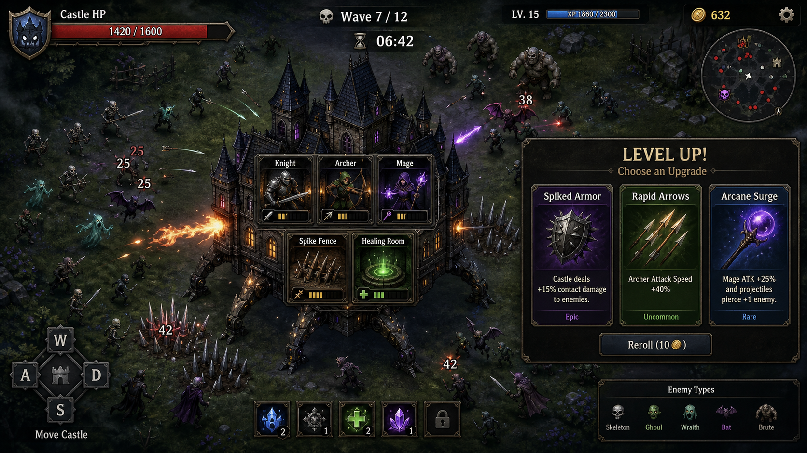
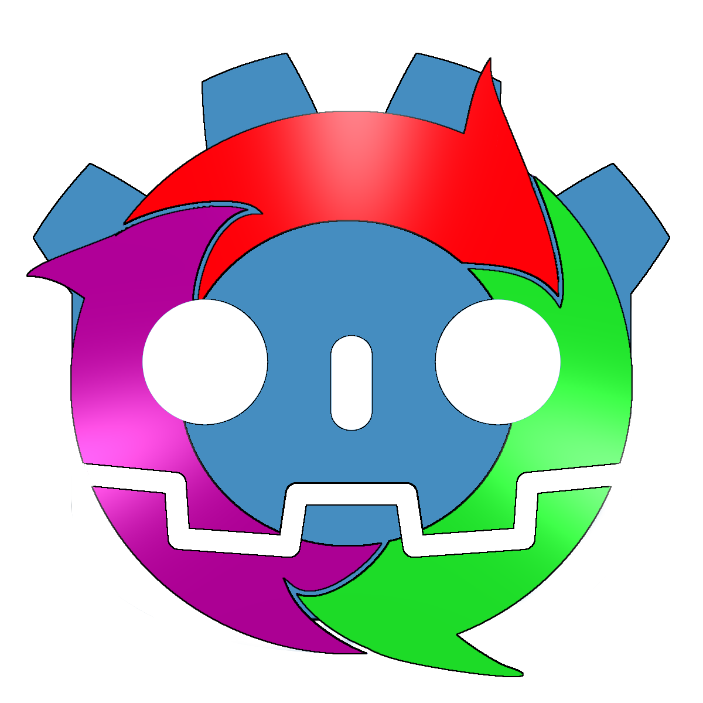

# Living Mansion (LM) 기획서

**버전:** v0.1.0
**최종 수정:** 2026-05-15
**엔진:** Godot 4.3 (GDScript)
**장르:** 뱀서라이크 + 성 디펜스 (로그라이트 스테이지 클리어)
**플랫폼:** Windows (PC)

---


---

## 플레이 미리보기

### 플레이 미리보기


---
## 1. 컨셉 요약

살아 움직이는 성(Living Mansion)을 조종하며 사방에서 몰려오는 적을 처치하는 뱀서라이크 게임.
플레이어는 성의 이동 방향을 조종하고, 성 내부 슬롯에 영웅과 시설을 배치해 자동 전투를 수행한다.
스테이지를 클리어하며 메타 영구 업그레이드로 성을 강화해 나간다.

---

## 2. 핵심 게임 루프

```
[홈 화면] → 스테이지 선택 → [배치 화면] → 전투 시작
→ [전투 (탑뷰)] → 레벨업 시 [3선택 팝업] → 웨이브 클리어 시 [정비 화면]
→ 보스 처치 → [보상 화면] → 메타 업그레이드
→ 게임 오버 시 [게임 오버 화면] → 재시작
```

### 화면 흐름

| 화면 | 설명 |
|------|------|
| MainMenu | 게임 시작, 업그레이드, 종료 |
| StageSelect | 스테이지 선택 (잠금 해제 기반) |
| PlacementScreen | 전투 전 영웅/시설 슬롯 배치 |
| Game (전투) | 탑뷰 자동 전투, WASD 이동 |
| LevelUpPopup | 레벨업 시 3선택지 (전투 일시정지) |
| WaveIntermission | 웨이브 사이 정비 시간 (15초 자동 시작) |
| ResultScreen | 스테이지 클리어/게임 오버 결과 |
| MetaScreen | 영구 업그레이드 구매 |

---

## 3. 스테이지 구성

- 스테이지당 **3~5 웨이브 + 보스 웨이브**
- 웨이브 진행에 따라 적 밀도와 종류 증가
- 스테이지 클리어 시 다음 스테이지 잠금 해제
- 런 실패 시 해당 스테이지 처음부터 재시작 (메타 업그레이드는 유지)

### Stage 1 웨이브 구성

| 웨이브 | 시간 | 스폰 간격 | 적 구성 | 최대 동시 적 |
|--------|------|----------|---------|------------|
| Wave 1 | 35초 | 2.5초 | 고블린 100% | 15 |
| Wave 2 | 40초 | 2.0초 | 고블린 70% + 오크 30% | 18 |
| Wave 3 | 45초 | 1.5초 | 고블린 50% + 오크 30% + 고블린궁수 20% | 20 |
| Boss | 120초 | 5.0초 | 보스 20% + 고블린 80% | 10 |

---

## 4. 성 & 슬롯 시스템

### 4.1 성 구조
- 탑뷰에서 WASD로 이동하는 거대 유닛 (속도: 120)
- 내부에 **선형으로 나열된 슬롯** 존재
- 기본 슬롯: **3개**, 메타 업그레이드로 최대 **6~7개**
- 성 전체 HP가 0이 되면 게임 오버

### 4.2 슬롯 규칙
- 각 슬롯에 영웅 또는 시설 중 하나 배치
- 빈 슬롯은 전투에 기여하지 않음
- 슬롯 추가는 메타 업그레이드에서만 가능

---

## 5. 영웅 시스템

### 5.1 영웅 목록

| 영웅 | 역할 | 데미지 | 공격속도 | 사거리 | 특성 |
|------|------|--------|---------|--------|------|
| 궁수 (Archer) | 단일 원거리 | 12 | 1.2/초 | 220 | 빠른 공격, 투사체 발사 |
| 마법사 (Mage) | 광역 원거리 | 18 | 0.7/초 | 250 | 최대 5체 동시 공격 (70% 데미지) |
| 기사 (Knight) | 근접 방어 | 20 | 0.9/초 | 70 | 투사체 없이 직접 타격 |
| 성직자 (Priest) | 지원 힐 | 8 (힐량) | 0.5/초 | - | 성 HP 회복 |
| 연금술사 (Alchemist) | 자원 생성 | 5 (골드) | 0.3/초 | - | 주기적 골드 생성 |

### 5.2 영웅 성장
- 레벨업 선택지에서 업그레이드 가능
- 레벨당 데미지 +15%, 사거리 +5%
- 메타 업그레이드로 초기 레벨 보정 가능

---

## 6. 시설 시스템

### 6.1 시설 목록

| 시설 | 역할 | 데미지 | 공격속도 | 사거리 | 최대 레벨 |
|------|------|--------|---------|--------|----------|
| 석궁 포탑 (Crossbow) | 단일 원거리 | 8 | 1.8/초 | 200 | 3 |
| 화염 투석기 (Catapult) | 광역 원거리 | 25 | 0.4/초 | 280 | 3 |
| 가시 방벽 (SpikeFence) | 근접 반사 | 6 | 2.0/초 | 60 | 3 |
| 치료 분수 (HealingFountain) | 성 힐 | 5 (힐) | 0.5/초 | - | 3 |
| 마나 오브 (ManaOrb) | 경험치 버프 | - | 1.0/초 | - | 3 |

### 6.2 시설 업그레이드
- 레벨당 데미지 +20%
- 최대 3레벨까지 업그레이드

---

## 7. 전투 시스템

### 7.1 성 이동
- **WASD / 방향키**로 이동 방향 조종
- 일정 속도(120)로 즉각 반응 이동
- 적과 충돌 시 성이 데미지를 받음

### 7.2 자동 공격
- 배치된 영웅/시설이 사거리 내 적을 자동 타겟팅
- 기본 타겟팅: 가장 가까운 적

### 7.3 레벨업 시스템
- 적 처치 시 경험치 획득 (xp_bonus 메타 업그레이드로 보정)
- 레벨업 시 **전투 일시정지 + 3선택지** 팝업
- 선택지: 새 영웅/시설 또는 기존 유닛 업그레이드 랜덤
- 필요 경험치: 10부터 시작, 레벨당 x1.2 증가

### 7.4 웨이브 사이 정비
- 웨이브 클리어 후 **15초** 정비 시간 (자동 시작)
- 웨이브 클리어 보상: 골드 +50

---

## 8. 적 시스템

### 8.1 적 목록

| 적 | HP | 이동속도 | 데미지 | 사거리 | 경험치 | 특성 |
|----|-----|---------|--------|--------|-------|------|
| 고블린 | 20 | 120 | 4 | 55 | 1 | 빠르고 약함, 다수 등장 |
| 오크 전사 | 80 | 55 | 12 | 60 | 3 | 느리고 강함 |
| 고블린 궁수 | 25 | 70 | 6 | 250 | 2 | 원거리 투사체 (속도 200) |
| 트롤 | 150 | 45 | 18 (x1.5) | 65 | 5 | 광역 1.5배 데미지 |
| 보스 (Stage 1) | 500 | 60 | 20 | 65 | 20 | HP 50% 이하 시 이동속도 1.5배 |

### 8.2 스폰 방식
- 성 위치 기준 500~600 거리의 랜덤 방향에서 스폰
- 가중치 기반 랜덤 적 선택

---

## 9. 메타 영구 업그레이드

스테이지 클리어 골드(200)로 구매. 런 간 영구 유지.

| 업그레이드 | 효과 | 비용 | 최대 레벨 | 레벨당 효과 |
|-----------|------|------|----------|-----------|
| 슬롯 확장 | 슬롯 +1 | 150G | 3 | +1 슬롯 |
| 성 HP 강화 | 최대 HP 증가 | 100G | 3 | +10 HP |
| 초기 골드 | 시작 골드 증가 | 80G | 3 | +50G (value_per_level) |
| 영웅 초기 레벨 | 영웅 시작 레벨 +1 | 200G | 3 | +1 레벨 |
| 경험치 보너스 | 적 처치 경험치 증가 | 120G | 3 | +10% |
| 시설 할인 | 시설 비용 감소 | 100G | 3 | -10% |

---

## 10. 세이브 시스템

- 저장 경로: `user://lm_save.json`
- 저장 항목: 메타 업그레이드 레벨, 해금된 스테이지, 보유 골드
- 업그레이드 구매 시 자동 저장

---

## 11. 기술 구조

### 오토로드
| 이름 | 역할 |
|------|------|
| SaveData | 메타 진행 저장/불러오기 |
| GameState | 런 상태 관리 (HP, XP, 슬롯, 시그널) |

### 씬 구조
```
scenes/
  main_menu/MainMenu.tscn      # 메인 메뉴
  stage_select/StageSelect.tscn # 스테이지 선택
  placement/PlacementScreen.tscn # 배치 화면
  game/
    Game.tscn                   # 전투 코디네이터
    castle/Castle.tscn          # 성 + 이동
    castle/Slot.tscn            # 슬롯
    units/Hero.tscn             # 영웅 기본 클래스
    units/Facility.tscn         # 시설 기본 클래스
    units/heroes/*.tscn         # 개별 영웅 (5종)
    units/facilities/*.tscn     # 개별 시설 (5종)
    enemies/Enemy.tscn          # 적 기본 클래스
    enemies/*.tscn              # 개별 적 (5종)
    projectiles/Projectile.tscn # 투사체
    wave/WaveManager.tscn       # 웨이브 관리
  ui/
    HUD.tscn                    # HP, XP, 레벨, 웨이브, 골드
    LevelUpPopup.tscn           # 레벨업 3선택
    WaveIntermission.tscn       # 웨이브 정비
    ResultScreen.tscn           # 클리어/게임오버 결과
    MetaScreen.tscn             # 영구 업그레이드
```

### 리소스 데이터
- `HeroData`, `FacilityData`, `EnemyData`, `WaveData`, `MetaUpgradeData`
- .tres 파일로 에디터에서 관리

---

## 12. 아트 & 분위기

- **스타일:** 캐주얼 판타지 (클래시로얄 스타일)
- **시점:** 탑뷰
- **색감:** 밝고 선명한 색상
- **현재:** 임시 도형 텍스처 사용 중

---

## 13. 버전 이력

| 버전 | 날짜 | 변경 사항 |
|------|------|----------|
| v0.1.0 | 2026-05-15 | MVP 완성 - 전체 게임 루프, Stage 1, 보상/게임오버 화면 |

<!-- RESOURCE_PREVIEWS_START -->
## 공유용 이미지 미리보기

> 자동 갱신: 2026-06-04. 공유 시 문서와 함께 아래 이미지 경로가 포함되어야 합니다.


- `addons/gut/gui/arrow.png`


- `addons/gut/gui/play.png`


- `addons/gut/icon.png`


- `addons/gut/images/GutIconV2_base.png`


- `addons/gut/images/GutIconV2_no_shine.png`


- `assets/art/ui/slot_frame.svg`

<!-- RESOURCE_PREVIEWS_END -->
